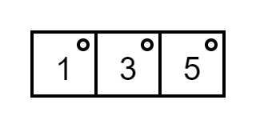
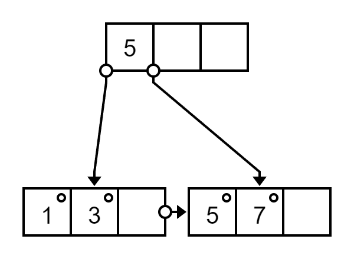
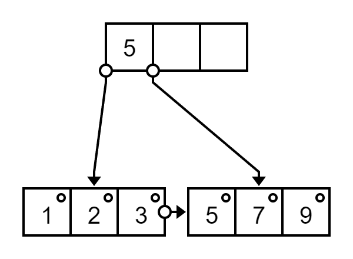
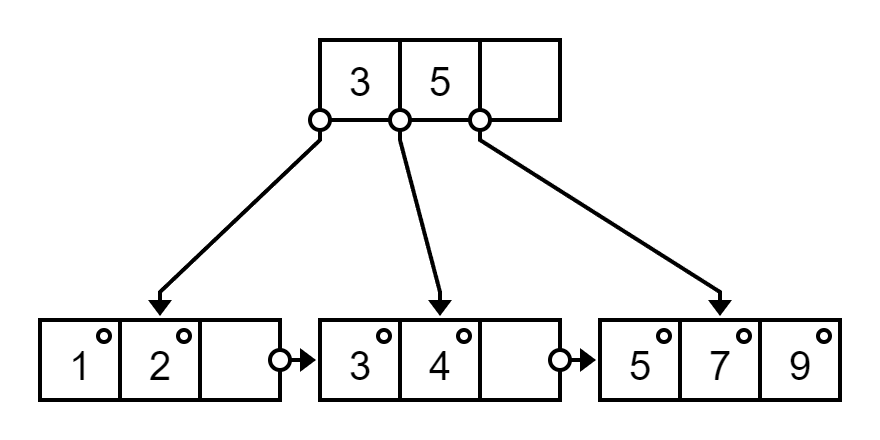
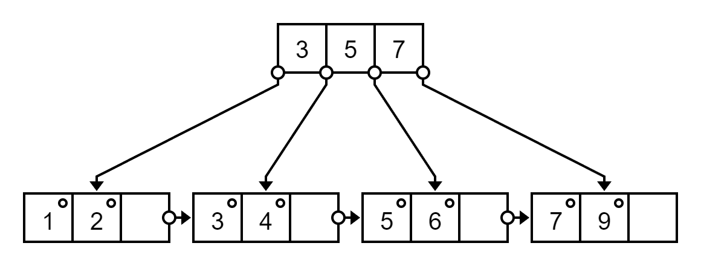
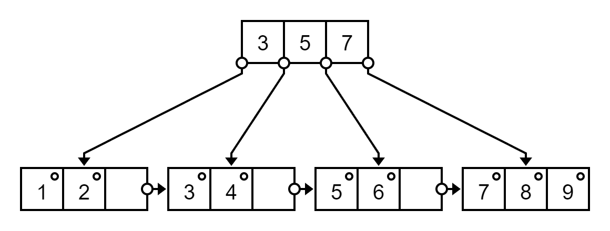
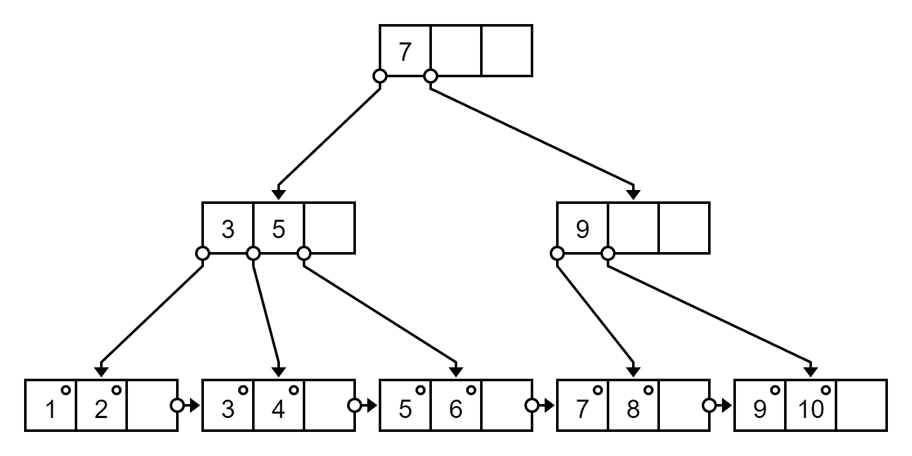

# Insertion Example

## Example 1

For `m` = 4  B+ tree

Insert `1, 3, 5, 7, 9, 2, 4, 6, 8, 10`

Insert `7`

It is `[1, 3, 5, 7]`, medium between `3` and `5`, by default it is right biasing, use `5` as index

Insert `9`, `2`

Insert `4`. It is `[1, 2, 3, 4]`, medium between `2` and `3`, use `3` as index

Insert `6`. It is `[5, 6, 7, 9]`, medium between `6` and `7`, use `7` as index

Insert `8`

Insert `10`, It is `[7, 8, 9, 10]`, medium between `8` and `9`, use `9` as index

In parent, It is `[3, 5, 7, 9]`, medium between `5` and `7`, use `7` as index (move as parent)

Be care in non-leaf node, the index will move upper, and replace with successor

