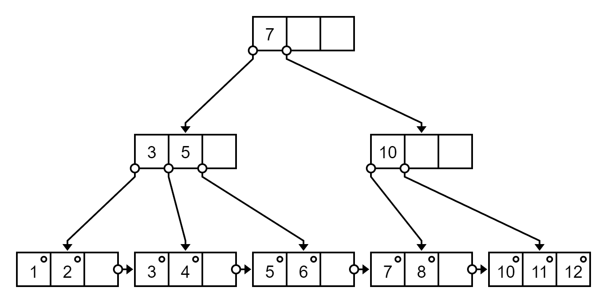

# Deletion Example


## Example 1

Delete `9, 7, 8` in following B+ Tree

[Online sketcher](https://projects.calebevans.me/b-sketcher/)

```
9
3,5,7/11
1,2/3,4/5,6/7,8/9,10/11,12
```

<div class="h-350">


</div>

Delete `9`

`[10]` is less than half full, need borrow or merge

Sibling node `[11, 12]` will less than half full if borrowing

Merge sibling tree, delete index `11`, then remaining is `[10, 11, 12]`, index is `10`

In `[3, 5, 7]` and `[10]`, left side can borrow

`7` go to parent, right side use `10` as index

<div class="h-350">



</div>

Delete `7`

`[8]` is less than half full

Sibling node is `[10, 11, 12]`, can borrowing

Move `10` to left side, it is `[8, 10]`

Use successor `11` as index

Check parent, replace `7` with successor `8`

<div class="h-350">


</div>

Delete `8`

It is `[10]`, right side cannot borrowing, need merge

Merge, `[10, 11, 12]`, delete index `11`, use `10` as index

In `[3, 5]` and `[10]`, left side cannot borrowing, need merge

Merge, `[3, 5, 10]`, delete index `8`

<div class="h-250">


</div>


