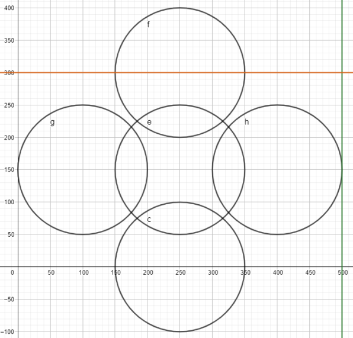
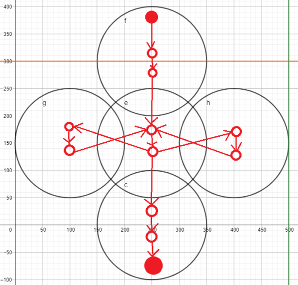

# UVa 11757 Winger Trial

https://onlinejudge.org/index.php?option=onlinejudge&page=show_problem&problem=2857

長 L 米和寬 W 米的矩形場地

---

放置了 N 個防守者，位置不改變

如果邊鋒與防守隊員的距離不超過 d 米，就會自動鏟球

一個防守者最多可以鏟球一次

---

開始時，邊鋒站在場地的左邊緣

他的任務是避開防守者，將球帶到場地最右邊

---

問：他到達另一端必須面對的最少鏟球次數

```cpp
#include <unordered_map>
#include <unordered_set>
#include <algorithm>
#include <iostream>
#include <utility>
#include <vector>
#include <queue>

struct State {
    int node;
    int parent;
};

bool findAugmentingPath(
    std::unordered_map<int, std::unordered_map<int, int>>& rGraph,
    int s, 
    int t,
    std::unordered_map<int, int>& parents
) {

    std::queue<State> queue;
    std::unordered_set<int> visited;
    queue.push({ s, -1 });
    parents.insert({ s, -1 });

    while (!queue.empty()) {
        State state = queue.front(); queue.pop();
        int node = state.node;
        int parent = state.parent;
        parents[node] = parent;

        if (node == t) {
            return true;
        }

        if (visited.count(node) != 0) continue;
        visited.insert(node);

        auto &others = rGraph[node];
        for (const auto& other : others) {
            if (visited.count(other.first) != 0) continue;
            if (other.second <= 0) continue;
            queue.push({ other.first, node });
        }

    }

    return false;
}

void parentToPaths(
    std::unordered_map<int, int>& parents,
    int s, 
    int t,
    std::vector<std::pair<int, int>>& paths
) {

    int current = t;
    while (current != s) {
        int parent = parents[current];
        paths.push_back({ parent, current });
        current = parent;
    }

}

int maxFlowNetwork(
    std::unordered_map<int, std::unordered_map<int, int>>& rGraph,
    int s, 
    int t
) {

    int maxFlowValue = 0;
    while (true) {
        std::unordered_map<int, int> parent;
        if (!findAugmentingPath(rGraph, s, t, parent)) break;
        std::vector<std::pair<int, int>> paths;
        parentToPaths(parent, s, t, paths);
        int min = 0x3f3f3f3f;
        for (const auto& path : paths) {
            if (rGraph[path.first][path.second] < min) {
                min = rGraph[path.first][path.second];
            }
        }
        for (const auto& path : paths) {
            rGraph[path.first][path.second] -= min;
            rGraph[path.second][path.first] += min;
        }
        maxFlowValue += min;
    }

    return maxFlowValue;
}

int distance2(int x1, int y1, int x2, int y2) {
    return (x1 - x2) * (x1 - x2) + (y1 - y2) * (y1 - y2);
}

int main() {
    std::ios::sync_with_stdio(false);
    std::cin.tie(nullptr);
    std::cout.tie(nullptr);

    int index = 1;
    int L, W, N, d;
    while (std::cin >> L >> W >> N >> d) {
        if (L == 0 && W == 0 && N == 0 && d == 0) break;
        std::unordered_map<int, std::unordered_map<int, int>> graph;

        std::vector<std::pair<int, int>> defener(N);
        for (int i = 0; i < N; i++) {
            std::cin >> defener[i].first >> defener[i].second;
        }

        int upperNode = 2 * N;
        int downNode = 2 * N + 1;
        int d2 = 4 * d * d;
        for (int i = 0; i < N; i++) {
            int x = defener[i].first;
            int y = defener[i].second;
            if (y - d <= 0) {
                int i_in = i;
                int i_out = N + i;
                graph[i_out][downNode] = 1;
            }
            if (y + d >= W) {
                int i_in = i;
                int i_out = N + i;
                graph[upperNode][i_in] = 1;
            }
        }

        for (int i = 0; i < N; i++) {
            int i_in = i;
            int i_out = N + i;
            graph[i_in][i_out] = 1;
        }

        for (int i = 0; i < N; i++) {
            for (int j = i + 1; j < N; j++) {
                int x1 = defener[i].first;
                int y1 = defener[i].second;
                int x2 = defener[j].first;
                int y2 = defener[j].second;
                int distance = distance2(x1, y1, x2, y2);
                if (distance <= d2) {
                    int i_in = i;
                    int j_in = j;
                    int i_out = N + i;
                    int j_out = N + j;
                    graph[i_out][j_in] = 1;
                    graph[j_out][i_in] = 1;
                }
            }
        }

        std::unordered_map<int, std::unordered_map<int, int>> rGraph = graph;
        int maxFlow = maxFlowNetwork(rGraph, upperNode, downNode);
        std::cout << "Case " << index++ << ": " << maxFlow << std::endl;
    }
    return 0;
}
```

解法：

上下兩端分別一個節點

防守者距離上下兩端不超過 d 米連在一起

防守者之間距離不超過 2d 連在一起

防守者節點有流量上限，所以內部需要分為 in out node, in to out length 1

最後 max flow 上去下，就是答案



左去右至少要經過中間一條，答案為 1



