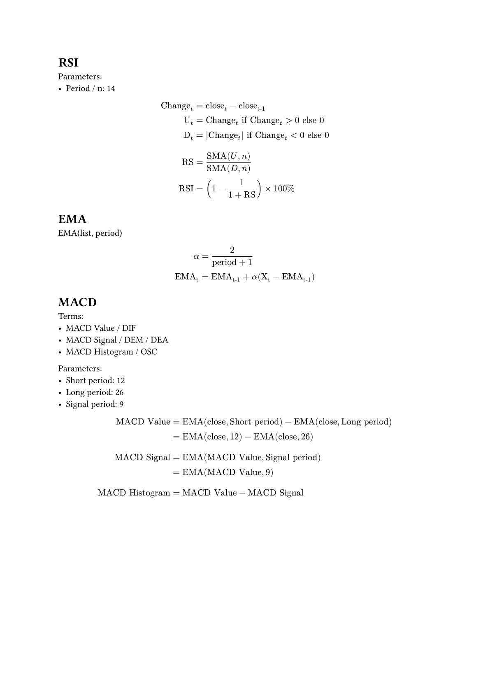

# Technical Indicators 技術指標




Typst:

```
#heading("RSI")

Parameters:
- Period / n: 14

$
"Change"_t &= "close"_t - "close"_"t-1" \
"U"_t &= "Change"_t "if" "Change"_t > 0 "else" 0 \
"D"_t &= abs("Change"_t) "if" "Change"_t < 0 "else" 0 \
\
"RS" &= frac("SMA"(U, n), "SMA"(D, n)) \
"RSI" &= (1 - frac(1, 1 + "RS")) times 100%
$

#heading("EMA")

EMA(list, period)

$
alpha &= frac(2, "period" + 1) \
"EMA"_"t" &= "EMA"_"t-1" + alpha ("X"_"t" - "EMA"_"t-1")
$

#heading("MACD")

Terms:
- MACD Value / DIF
- MACD Signal / DEM / DEA
- MACD Histogram / OSC

Parameters:
- Short period: 12
- Long period: 26
- Signal period: 9

$
"MACD Value" &= "EMA"("close", "Short period") - "EMA"("close", "Long period") \
             &= "EMA"("close", 12) - "EMA"("close", 26) \
\
"MACD Signal" &= "EMA"("MACD Value", "Signal period") \
              &= "EMA"("MACD Value", 9) \
\
"MACD Histogram" &= "MACD Value" - "MACD Signal"
$
```